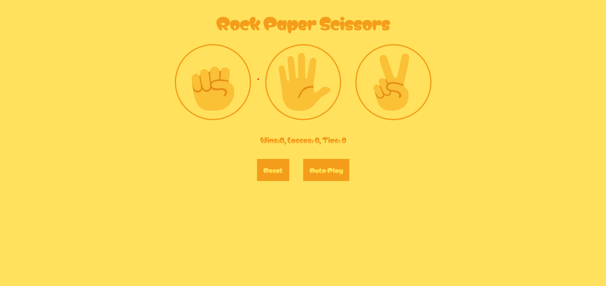
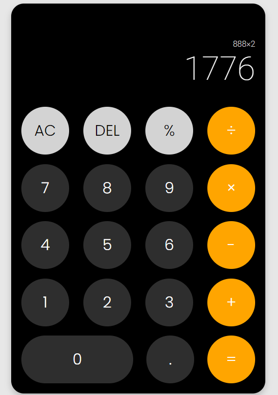

# Javascript Projects

> Simple and small projects using pure javascript

## General Information

- Rock, Paper, scissors game

## Technologies Used

- Javascript
- HTML
- CSS

## Screenshots

### Most recent: Weather App
- A responsive web that uses [Weather](https://openweathermap.org/current) API. This web will change appearance based on current time by using [dayjs](https://www.npmjs.com/package/dayjs)

  

### Todo project
- A simple Todo project that uses javascript list and localStorage to save and display data based on user input 

  

### Rock Paper Scissors game
- A simple rock paper scissors game that utilises javascript listeners and localStorage to keep score

  

### Calculator project
- A simple calculator project that displays the numbers dynamically as the user types it out 

  

